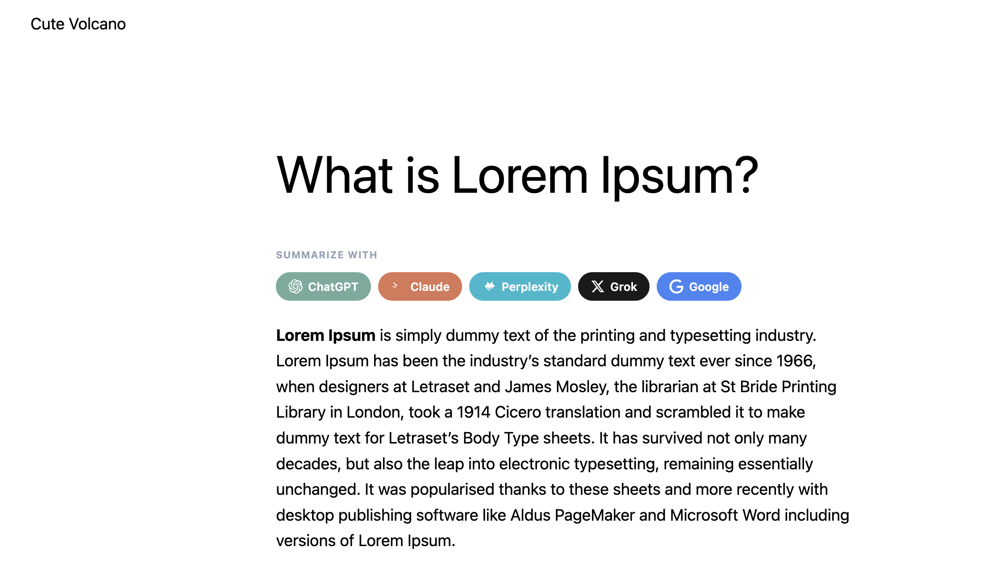
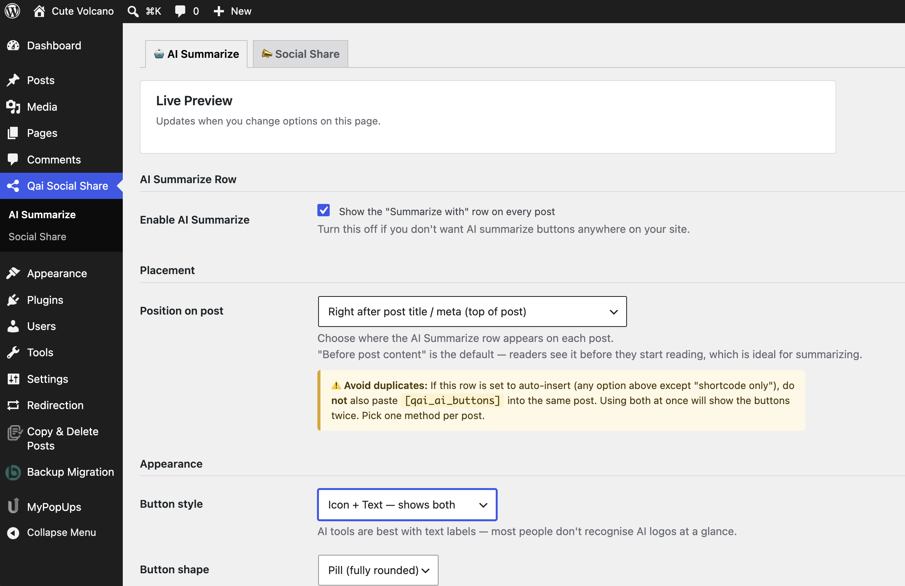
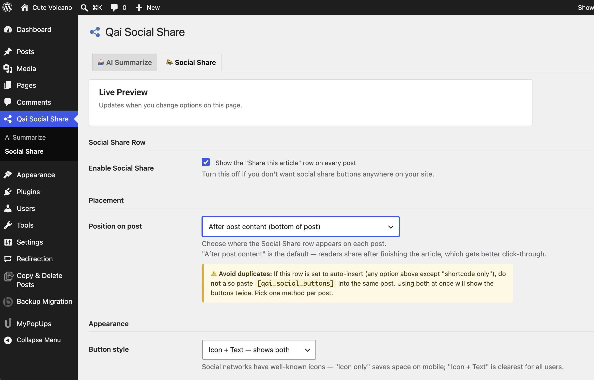

# Qai Social Share

A WordPress plugin that adds **AI Summarize** buttons and **Social Share** buttons to your blog posts — fully configurable from the WordPress dashboard, no theme editing required.

   

---

## Screenshots

### AI Summarize buttons on a live post


### AI Summarize settings page


### Social Share settings page


---

## Features

### 🤖 AI Summarize Row
Lets readers instantly summarize your post in their preferred AI tool:
- ChatGPT, Claude, Perplexity, Grok, Google AI Mode

### 📣 Social Share Row
One-click sharing to all major platforms:
- Facebook, X (Twitter), WhatsApp, LinkedIn, Telegram, Pinterest
- Copy Link button (copies post URL to clipboard)

### ⚙️ Two Separate Settings Tabs
Found at **Qai Social Share** in your WordPress dashboard sidebar:

**AI Summarize tab:**
- Enable/disable the AI row independently
- Position: Before content, After title/meta, After content, or Shortcode only
- Button style: Text only / Icon only / Icon + Text
- Button shape: Pill / Rounded / Square
- Row label (editable)
- AI prompt template (editable, must include `{url}`)
- Toggle individual AI tools on/off

**Social Share tab:**
- Enable/disable the social row independently
- Position: independent from AI row
- Button style: Text only / Icon only / Icon + Text
- Row label (editable)
- Copy Link button toggle
- Toggle individual networks on/off

### 🔁 Smart Shortcode Detection
- Buttons auto-insert based on your position setting
- If a post already contains `[qai_ai_buttons]`, auto-injection of the AI row is skipped for that post — no duplicates
- Same logic applies per-row independently (social shortcode only suppresses social auto-inject)

---

## Shortcodes

| Shortcode | Output |
|---|---|
| `[qai_ai_buttons]` | AI Summarize row only |
| `[qai_social_buttons]` | Social Share row only |
| `[qai_buttons]` | Both rows together |

> **⚠️ Avoid duplicates:** If a row is set to auto-insert, do not also paste its shortcode into the same post. Pick one method per row per post.

---

## Installation

1. Download the latest `.zip` from [Releases](https://github.com/ixehad/qai-social-share/releases)
2. In WordPress admin → **Plugins → Add New → Upload Plugin**
3. Upload the zip → **Install Now → Activate**
4. Go to **Qai Social Share** in the left sidebar

---

## File Structure

```
qai-social-share/
├── qai-social-share.php          # Main plugin bootstrap
├── readme.txt                    # WordPress.org readme
├── assets/                       # WP.org banner + icon assets
│   ├── banner-772x250.png
│   ├── banner-1544x500.png
│   ├── icon-128x128.png
│   └── icon-256x256.png
├── includes/
│   ├── class-kas-settings.php    # Two-tab admin settings page
│   ├── class-kas-render.php      # Button HTML output (text/icon/icon+text)
│   └── class-kas-loader.php      # Shortcodes + per-row content injection
└── assets/ (plugin runtime)
    ├── front.css                 # Front-end button styles
    ├── front.js                  # Copy-link clipboard handler
    ├── admin.css                 # Settings page styles
    └── admin.js                  # Live preview + enable/disable dimming
```

---

## External Services

This plugin redirects readers to third-party services when they click a button. No data is sent automatically — only on explicit user click.

| Service | URL | Terms |
|---|---|---|
| ChatGPT | chatgpt.com | [Terms](https://openai.com/policies/terms-of-use) |
| Claude | claude.ai | [Terms](https://www.anthropic.com/legal/consumer-terms) |
| Perplexity | perplexity.ai | [Terms](https://www.perplexity.ai/hub/legal/terms-of-service) |
| Grok | x.com/i/grok | [Terms](https://x.com/en/tos) |
| Google | google.com | [Terms](https://policies.google.com/terms) |
| Facebook | facebook.com | [Terms](https://www.facebook.com/terms.php) |
| X (Twitter) | twitter.com | [Terms](https://twitter.com/tos) |
| WhatsApp | api.whatsapp.com | [Terms](https://www.whatsapp.com/legal/terms-of-service) |
| LinkedIn | linkedin.com | [Terms](https://www.linkedin.com/legal/user-agreement) |
| Telegram | t.me | [Terms](https://telegram.org/tos) |
| Pinterest | pinterest.com | [Terms](https://policy.pinterest.com/terms-of-service) |

---

## Security

- All output escaped via `esc_url()`, `esc_html()`, `esc_attr()`
- CSRF protection via `register_setting()` + `settings_fields()`
- Settings page gated behind `manage_options` capability
- No external requests made by the plugin itself
- No user data collected or transmitted

---

## Requirements

- WordPress 5.8+
- PHP 7.0+

---

## Changelog

### 1.2.0
- Two separate admin tabs: AI Summarize and Social Share
- Independent position selector per row
- Three button display styles: Text only / Icon only / Icon + Text
- Inline SVG icons for all networks and AI tools
- Fixed shortcode duplication bug (per-row detection)
- Renamed shortcodes from `[kas_*]` to `[qai_*]`
- Live preview on each settings tab
- Duplicate-warning notices on position selectors

### 1.1.0
- Renamed to Qai Social Share
- Top-level dashboard menu
- Live preview on settings page
- Various bug fixes

### 1.0.0
- Initial release

---

## License

GPL v2 or later

---

Built by Jehadul Islam
